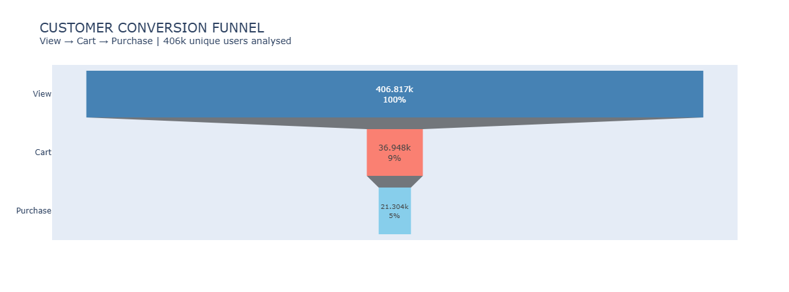
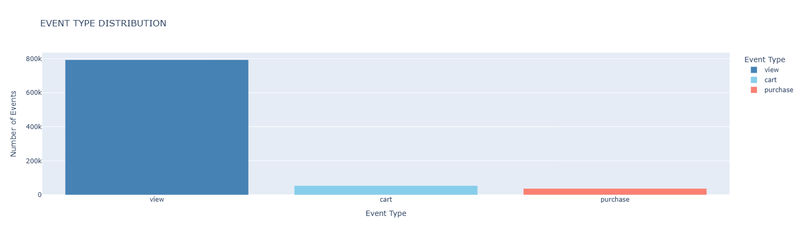
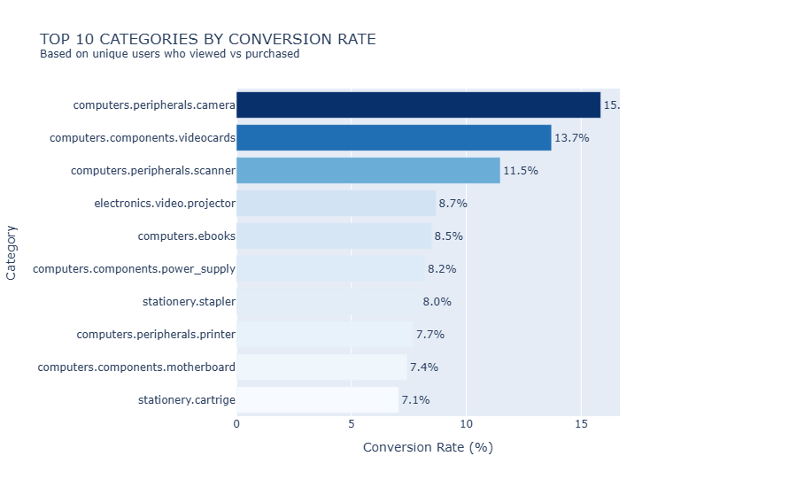
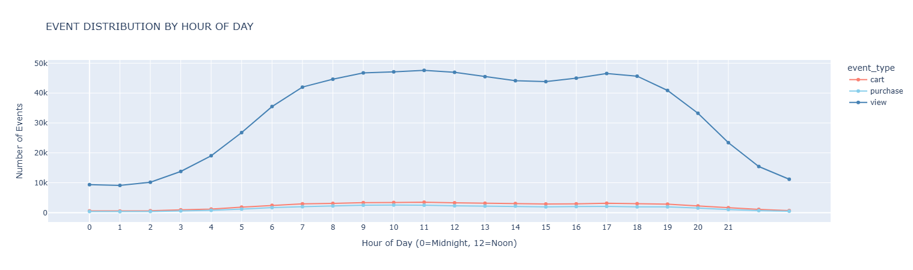
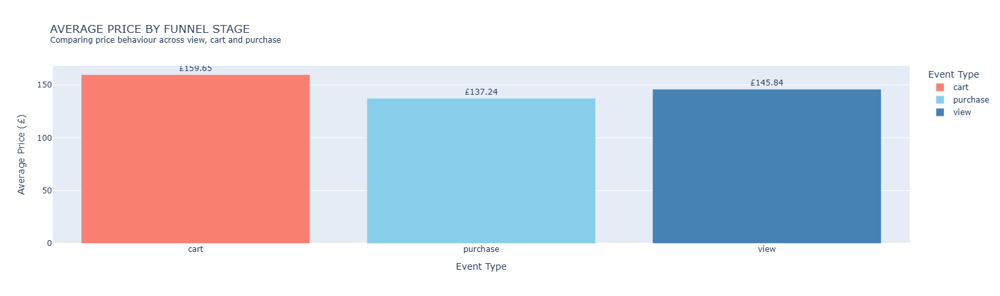

# 🛒 E-Commerce Funnel Analysis
## Understanding Customer Drop-off and Conversion Optimisation

## 📌 Project Overview
This project analyses behavioural event data from a large 
electronics e-commerce store spanning five months between 
October 2019 and February 2020. The dataset contains over 
885,000 event records capturing how users interact with 
products across three key funnel stages: viewing, carting 
and purchasing.

## 🎯 Business Problem
Despite high traffic volumes the store lacks clear visibility 
into where customers are dropping off in the purchase journey. 
Without this understanding significant revenue is being lost 
at every stage of the funnel — from product views through 
to completed purchases.

## 🏆 Project Aim & Objectives
To analyse the e-commerce customer journey and deliver 
actionable insights that help the business reduce drop-off 
rates, improve conversion performance and maximise revenue.

1. Map the complete customer funnel from view to purchase
2. Calculate conversion rates at each funnel stage
3. Identify where the highest drop-offs occur
4. Segment the funnel by product category and brand
5. Examine price sensitivity and its impact on purchases
6. Identify peak trading periods by month and day
7. Quantify revenue lost due to cart abandonment
8. Deliver actionable recommendations to improve conversion

## 🛠️ Tools & Technologies
| Tool | Purpose |
|------|---------|
| Python (Pandas, Plotly, NumPy) | Data cleaning and manipulation |
| Matplotlib & Seaborn | Data visualisation |
| Jupyter Notebook | Analysis and documentation |
| GitHub | Version control and documentation |

## 📁 Project Structure
ecommerce-funnel-analysis/
│
├── data/
│ ├── raw/ → Original dataset (see Kaggle link)
│ └── cleaned/ → Cleaned and processed dataset
│
├── notebooks/ → Jupyter notebooks
│ ├── 01_data_cleaning.ipynb
│ ├── 02_exploratory_analysis.ipynb
│ └── 03_funnel_analysis.ipynb
│
├── images/ → Chart screenshots
└── README.md

## 📊 Analysis & Visualisations

### Conversion Funnel

### Event Type Distribution

### Top Categories by Conversion

### Hourly Traffic Distribution

### Average Price by Funnel Stage

## 🔍 Key Findings

- 📌 Only 6.1% of viewers add to cart and 4.2% complete 
  a purchase — confirming a clear funnel drop-off pattern

- 📌 The business has a product discovery problem not a 
  checkout problem — 91% drop off before adding to cart 
  but 57.66% of cart users complete purchase

- 📌 Videocards dominate platform activity with 116,712 
  events confirming strong GPU demand from PC builders

- 📌 Peak shopping window is 10am-6pm with 40k-45k events 
  — evening spend yields significantly lower returns

- 📌 A £22.41 price gap exists between average cart price 
  (£159.65) and purchase price (£137.24) revealing a 14% 
  price sensitivity threshold

- 📌 Gigabyte represents the greatest revenue opportunity 
  combining high traffic (9,425 views) with strong 
  conversion (11.97%)

- 📌 Sapphire leads all brands with 15.90% conversion rate 
  confirming strong PC components demand

## 💡 Strategic Recommendations

- ❖ Prioritise view-to-cart optimisation — a 2% improvement 
  adds approximately 8,000 more buyers

- ❖ Focus marketing partnerships on Gigabyte and MSI for 
  maximum revenue impact

- ❖ Introduce Buy Now Pay Later options for items above 
  £150 to bridge the price sensitivity gap

- ❖ Develop dedicated gaming audience campaigns targeting 
  Steelseries buyers — high conversion, underleveraged

- ❖ Concentrate promotional spend between 10am and 6pm 
  where traffic peaks at 40k-45k events

## 👩🏽‍💻 About the Author
**Zuera Alabi**
Data Analyst | Python | SQL | Power BI | Excel

Behind every dataset is a decision waiting to be made — 
I help businesses find it.

🔗 [LinkedIn](https://www.linkedin.com/in/zuera-alabi-4b85a7282/)
🔗 [GitHub](https://github.com/zuera-alabi)
